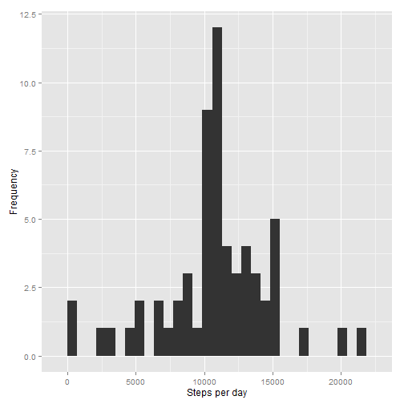

# Reproducible Research: Peer Assessment 1

##Loading required libraries


```r
#install.packages("ggplot2")
library(ggplot2)
library(knitr)
library(markdown)
```

## Loading and preprocessing the data


```r
acdat <-  read.csv(unz("activity.zip", "activity.csv"),
                   header = TRUE,
                   colClasses = c("numeric","POSIXct","numeric"))
```

## What is mean total number of steps taken per day?

```r
  stepsperday <- with(acdat,tapply(steps,date,sum,na.rm=T))
  binw <- (range(stepsperday,na.rm = T)[2]-range(stepsperday,na.rm = T)[1])/30
  qplot(stepsperday, binwidth =binw, xlab= "Steps per day", ylab = "Frequency")
```

 

```r
means <- mean(stepsperday)
medians <- median(stepsperday)
```

The mean of the daily steps is 9354.23 and its median, 10395.00.


## What is the average daily activity pattern?


```r
acdat$datetime <- acdat$date+acdat$interval*60  
 ggplot(acdat, aes(datetime, steps)) + geom_line(color="steelblue")+ ylab("Number of steps") + xlab("Date/time")
```

```
## Warning: Removed 354 rows containing missing values (geom_path).
```

 

```r
maxd <- which.max(acdat$steps)
```

The 5-minute interval 615 on 2012-11-27 contains the maximum number of steps (806).

## Imputing missing values

The orginal data contains some missing values2304.

In order to perform an exploratory analysis, the missing values were imputed using the day average steps for all the data. The R code used is he following.


```r
    acdat2 <- acdat
    acdat2[is.na(acdat2$steps),1] <- mean(acdat2$steps,na.rm =T)   

  stepsperday2 <- with(acdat2,tapply(steps,date,sum,na.rm=T))
  binw2 <- (range(stepsperday2,na.rm = T)[2]-range(stepsperday2,na.rm = T)[1])/30
  qplot(stepsperday2, binwidth =binw2, xlab= "Steps per day", ylab = "Frequency")
```

 

```r
  means2 <- mean(stepsperday2)
  medians2 <- median(stepsperday2)
```

After imputing the missing values the mean and median are 10766.19 and 10766.19, respectively.

## Are there differences in activity patterns between weekdays and weekends?

The activity patters differ btween weekends and midweek. this can be observe in the following plot.


```r
weekend <- c(weekdays(as.Date(c("19072014","20072014"),format="%d%m%Y")))
acdat2$weekday <- ifelse(weekdays(acdat2$date) %in% weekend, "weekend", "weekday")
acdat2$weekday <- as.factor(acdat2$weekday)

ggplot(acdat2, aes(interval,steps)) + geom_line(color = "steelblue") + facet_wrap(~ weekday,2) + xlab(label = "Interval") + ylab("Number fo steps")
```

 


